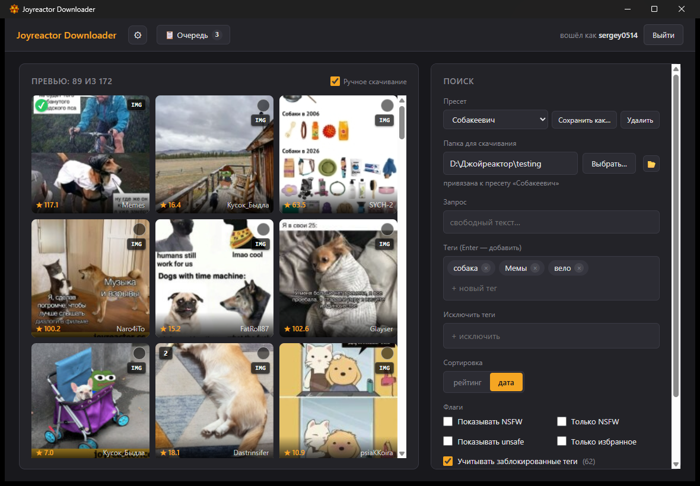
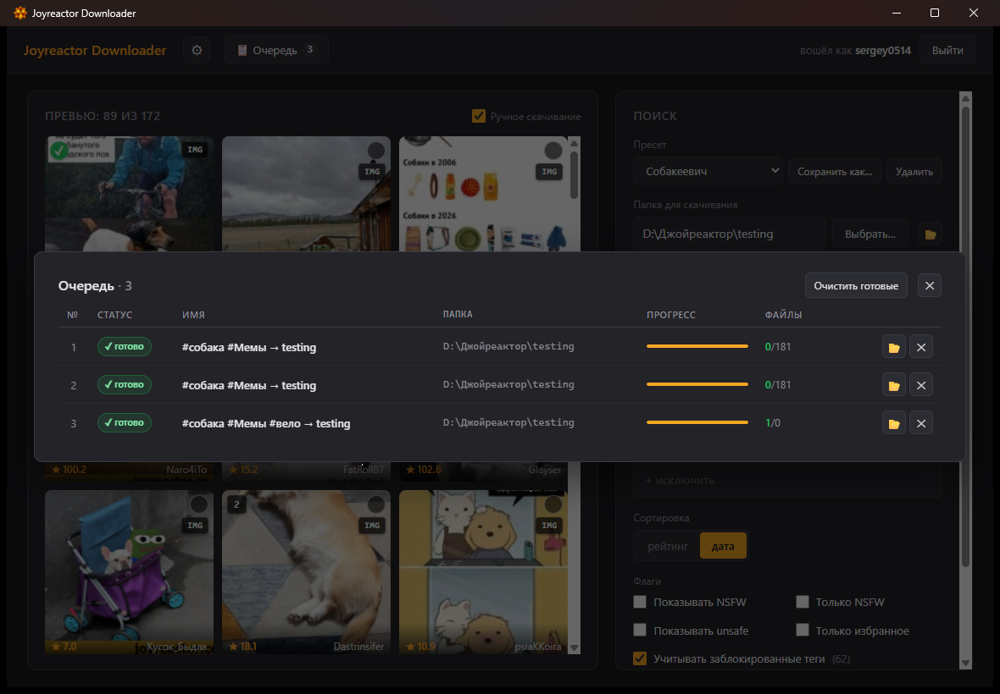
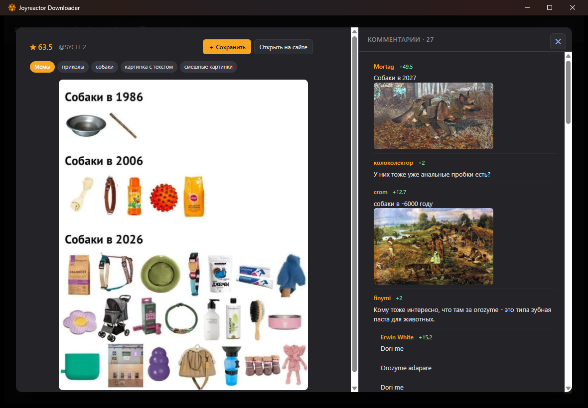
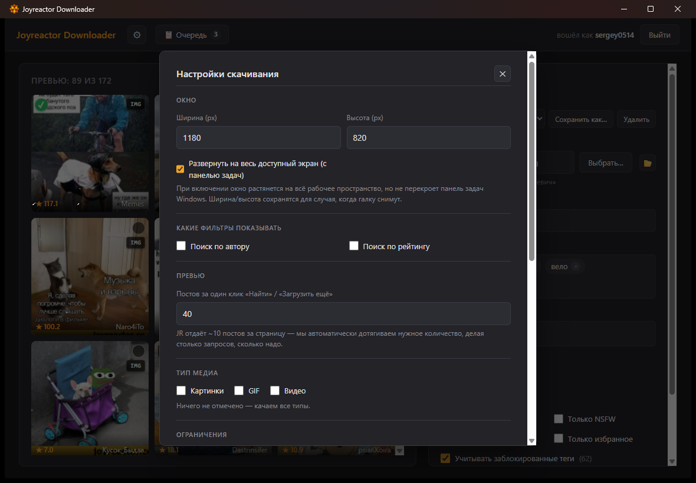

# joyreactorDownloader

Десктоп-приложение для пакетной выгрузки картинок с
[joyreactor.cc](https://joyreactor.cc) по фильтрам — теги, автор, рейтинг,
дата, NSFW и т.д. Использует официальный GraphQL API (не парсит HTML),
сохраняет логин-сессию между запусками, дедуплицирует уже скачанное.

Под капотом: Go + [Wails v2](https://wails.io) (Go-бэкенд + WebView2 +
HTML/CSS/JS-фронт). Один статический бинарник без рантаймов.



## Возможности

- **Фильтры из коробки Joyreactor**: текст, теги (включая исключения),
  автор, мин/макс рейтинг, NSFW / unsafe / «только избранное»; плюс
  клиент-сайд: тип медиа (JPEG/PNG/GIF/MP4/WEBM), мин. ширина/высота,
  диапазон дат, лимит файлов.
- **Авторизация** cookie-based — сессия сохраняется в `%APPDATA%/joyreactorDownloader/`,
  при перезапуске восстанавливается. Учитывает заблокированные пользователем теги.
- **Пресеты фильтров** с привязкой папки скачивания. Последний выбранный
  пресет восстанавливается при следующем запуске.
- **Очередь задач** с паузой / возобновлением / отменой, отдельным
  прогрессом и параллельными скачиваниями нескольких задач.
- **Превью-сетка** с тегами-индикаторами (NSFW / тип медиа / число
  картинок в посте / уже скачано). Клик по плитке открывает превью поста
  с комментариями.
- **Ручной режим**: чекбоксы на тайлах, выделение мышкой-рамкой,
  «Сохранить» прямо из превью поста — для точечного выбора без массовой
  загрузки.
- **Дедуп** через `.manifest.json` в каждой папке скачивания: повторный
  запуск задачи скипает то, что уже на диске.
- **Имена файлов**: либо `<postId>_<attrId>.<ext>`, либо
  `[tag1][tag2][tag3]_<postId>_<attrId>.<ext>` (алфавитная сортировка
  тегов → одинаковый пост всегда даёт одинаковое имя).
- **Системные тосты** при завершении/отмене/ошибке (Windows — нативные
  WinRT toast'ы; macOS/Linux — no-op).
- **Single-instance lock**: второй запуск exe фокусирует уже открытое окно.

### Скриншоты

| Очередь задач                                | Превью поста с комментариями                         |
| -------------------------------------------- | ---------------------------------------------------- |
|        |    |

| Настройки                                      |
| ---------------------------------------------- |
|     |

## Установка

Бинарники собираются в [GitHub Actions](.github/workflows/build.yml) под
Windows / macOS / Linux. Скачать из релизов или собрать самому:

```sh
# Зависимости: Go 1.22+, Node 18+, Wails CLI v2.12.0
go install github.com/wailsapp/wails/v2/cmd/wails@v2.12.0

# Linux дополнительно: libwebkit2gtk-4.0-dev libgtk-3-dev pkg-config

cd cmd/joyreactor-gui
wails build -clean
# Результат: cmd/joyreactor-gui/build/bin/joyreactorDownloader[.exe|.app]
```

## Использование

1. Запустить exe → войти в аккаунт JR (опционально, но рекомендуется —
   часть контента требует логин).
2. Настроить фильтры в правой панели, указать папку скачивания.
3. «🔍 Найти» — посмотреть превью.
4. «＋ Добавить в очередь» — отправить полную выборку на скачивание.
5. Или включить «Ручное скачивание» в шапке превью, выбрать конкретные
   плитки чекбоксами / рамкой, потом «＋ Добавить выбранные».
6. Прогресс — в «📋 Очередь» в шапке.

Пресеты («Сохранить как…») запоминают весь набор фильтров + папку, так
что переключение между типами выгрузок («только GIF от @kuiwi», «арт с
рейтингом ≥200», и т.д.) — это один клик.

## CLI (опционально)

Параллельно с GUI есть CLI для скриптинга и отладки логики:

```sh
go run ./cmd/joyreactor-dl -tag art -min-rating 200 -limit 5 -out ./downloads
go run ./cmd/joyreactor-dl -h
```

## Разработка

Полная инструкция для разработчиков в [CLAUDE.md](CLAUDE.md) (структура
проекта, конвенции, команды).

Все частые команды собраны в `Makefile` (для macOS/Linux + Windows с
установленным GNU Make: `choco install make` или `scoop install make`).
Тем, кому лень ставить make, доступна PowerShell-обёртка с теми же
таргетами:

```sh
make help                              # список всех команд
make build                             # production exe
make dev                               # wails dev (hot reload)
make test                              # юнит-тесты
make check                             # fmt + vet + test
make screenshot                        # снимок окна для UI-проверки
make clean                             # удалить артефакты сборки

# Windows без make:
powershell -File scripts/make.ps1 help
powershell -File scripts/make.ps1 build
```

Без шорткатов то же самое руками:

```sh
cd cmd/joyreactor-gui
wails dev                              # hot-reload dev режим
wails build -clean                     # production exe (~11 MB)

# Тесты бьём из корня (модульные пути работают везде)
go test ./...                          # юнит-тесты
go test -tags=integration ./...        # + удар по живому API
```

### Структура

Раскладка следует [golang-standards/project-layout](https://github.com/golang-standards/project-layout):

```
cmd/
├── joyreactor-gui/           Wails GUI: main + gui/jobs/proxy/window/presets/...
│   ├── wails.json            конфиг Wails (CLI ищет относительно него)
│   ├── frontend/             HTML/CSS/JS интерфейс (Vite, vanilla)
│   └── build/                иконки, Windows manifest, NSIS-шаблон
└── joyreactor-dl/            CLI-точка входа (отладка/скриптинг)

internal/                     приватные пакеты, ядро переиспользуется GUI и CLI
├── graphql/                  GraphQL-клиент, Search/Login/Me, Relay ID, FileURL
├── filter/                   Criteria и клиент-сайд Match*
├── client/                   HTTP-клиент для CDN
├── downloader/               сохранение файлов + манифест дедупа
└── app/                      оркестратор (используется CLI)

api/schema/                   дамп GraphQL-схемы для офлайн-сверки
docs/                         документация + screenshots для README
scripts/                      PowerShell-автоматизация UI (см. ниже)
screenshots/                  gitignored — место для скриншотов автоматизации
.github/workflows/            CI (build матрица на 3 OS + auto Release)
```

### Автоматизация UI

В `scripts/` лежат PowerShell-хелперы для UI-тестирования: захват окна в
PNG (`screenshot.ps1` через `PrintWindow` минуя z-order), эмуляция кликов
/ клавиш / ввода текста / drag / scroll — все в window-relative
координатах. См. CLAUDE.md → раздел «UI-автоматизация».

## Где хранится сессия

- Windows: `%APPDATA%\joyreactorDownloader\session.json`
- macOS: `~/Library/Application Support/joyreactorDownloader/session.json`
- Linux: `~/.config/joyreactorDownloader/session.json`

Файл содержит только сессионный cookie, пароль никогда не сохраняется.
Удалить вручную, чтобы выйти.

## Что НЕ делает

- Не обходит капчу / антибот — для личного использования с разумными лимитами.
- Не делает мульти-аккаунтные сценарии / массовый скрейп.
- Не хранит пароль — только сессионный cookie.

## Лицензия

[MIT](LICENSE)
